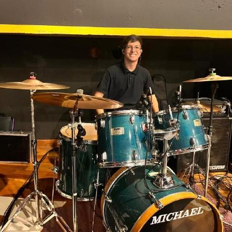
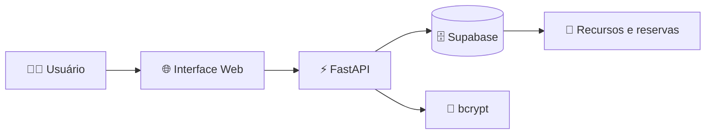

<div align="center">

  

  # 🚀 Reserva SENAI

  <p><strong>Gestão inteligente de reservas de salas, laboratórios e equipamentos.</strong></p>

  <p>
    ✨ Organize ocupação, consulte disponibilidade e simplifique o agendamento
    dos recursos do SENAI em um único lugar.
  </p>

  <p>
    
    
    
    
    
  </p>

  <p>
    
  </p>

</div>

---

## 💡 Sobre o projeto

O **Reserva SENAI** é uma plataforma web para organizar e controlar reservas
de salas, laboratórios, gabinetes e equipamentos.

A aplicação reduz o uso de planilhas, centraliza informações de disponibilidade
e oferece uma experiência mais rápida para professores e equipe administrativa.

## 👥 Nossa equipe

<table>
  <tr>
    <td align="center" width="50%">
      <h3>🧑‍💻 Matheus Catarucci</h3>
      
      <p><strong>Scrum Master • Back-end</strong></p>
      <p>Desenvolveu a API, o sistema de criptografia e auxiliar na coordenação geral do projeto.</p>
    </td>
    <td align="center" width="50%">
      <h3>⚙️ Guilherme Ballestrin</h3>
      
      <p><strong>Desenvolvedor Back-end</strong></p>
      <p>Auxiliou nas rotas gerais da API e na integração geral do projeto.</p>
    </td>
  </tr>
  <tr>
    <td align="center" width="50%">
      <h3>🎨 João Vitor</h3>
      
      <p><strong>Desenvolvedor Front-end • UI/UX</strong></p>
      <p>Desenvolveu as páginas HTML e realizou a estilização CSS da interface.</p>
    </td>
    <td align="center" width="50%">
      <h3>🎨 Gabriel</h3>
      
      <p><strong>Desenvolvedor Front-end • UI/UX</strong></p>
      <p>Desenvolveu as páginas HTML e realizou a estilização CSS da interface junto com as animações do JavaScript.</p>
    </td>
  </tr>
  <tr>
    <td align="center" colspan="2">
      <h3>🗄️ Moisés Tafarello</h3>
      
      <p><strong>Manipulador de Dados</strong></p>
      <p>Desenvolveu e arquitetou o banco de dados, responsável pelos testes e pela implantação dos serviços.</p>
    </td>
  </tr>
</table>

### 🎯 Funções da equipe

- **Matheus:** liderança do Scrum, desenvolvimento da API e criptografia.
- **Guilherme:** rotas da API, integração e suporte ao back-end.
- **João Vitor:** interface, experiência do usuário, HTML e CSS.
- **Gabriel:** interface, experiência do usuário, HTML, CSS e JS.
- **Moisés:** modelagem de dados, banco, testes e implantação.

## 🎓 Nossa história

Somos o **Grupo 6 do SENAI Jundiaí — Conde Alexandre Siciliano**, formado por
cinco estudantes que transformaram uma ideia em uma solução digital.

O Reserva SENAI nasceu da tentativa de organizar a rotina de reservas de salas,
laboratórios e equipamentos. Identificados por planilhas, mensagens e conversas,
o projeto queria oferecer um lugar centralizado, simples e seguro para consultar
recursos e acompanhar agendamentos.

Mais do que um sistema, este trabalho representa nossa evolução como
desenvolvedores: aprendemos a transformar necessidades reais em uma solução
web funcional, cuidada em cada detalhe.

## 🧠 O que aprendemos

- 💻 Desenvolver uma aplicação web com FastAPI e Python.
- 🗄️ Integrar uma aplicação com o Supabase.
- 🔐 Implementar autenticação e hash de senhas com bcrypt.
- 🎨 Construir uma interface responsiva com HTML, CSS e JavaScript.
- 🤝 Trabalhar em equipe, dividir responsabilidades e resolver problemas juntos.

## ✨ Funcionalidades

<table>
  <tr>
    <td width="50%">

### 🗓️ Reservas inteligentes

- Consulta de disponibilidade em tempo real.
- Reserva de salas, laboratórios e equipamentos.
- Acompanhamento de reservas e histórico de utilização.

    </td>
    <td width="50%">

### 🔐 Acesso seguro

- Autenticação protegida com **bcrypt**.
- Senhas nunca armazenadas em texto plano.
- Sessão de usuário para proteger páginas administrativas.

    </td>
  </tr>
  <tr>
    <td width="50%">

### 👨‍💼 Gestão centralizada

- Área administrativa para gestão dos recursos.
- Organização de usuários e permissões.
- Menos trabalho manual e mais eficiência.

    </td>
    <td width="50%">

### 📱 Experiência responsiva

- Interface adaptada para desktop e celular.
- 📋 Menus organizados
- Navegação simples e intuitiva.

    </td>
  </tr>
</table>

## 🛠️ Tecnologias utilizadas

| Tecnologia | Utilização |
|---|---|
| **FastAPI** | Framework da API e servidor web |
| **Python** | Backend da aplicação |
| **Supabase** | Persistência de usuários e dados |
| **HTML5** | Estrutura das páginas |
| **CSS3** | Layout, responsividade e identidade visual |
| **JavaScript** | Interações no frontend |
| **bcrypt** | Hash seguro das senhas |

## 🔄 Como funciona?



## 🚀 Começando

### Pré-requisitos

- Python 3.10 ou superior.
- Um projeto no Supabase configurado.
- Variáveis de ambiente do Supabase.

### 1. Clone o repositório

```bash
git clone https://github.com/seu-usuario/reserva-senai.git
cd reserva-senai
```

### 2. Crie um ambiente virtual

<details>
<summary><strong>Windows</strong></summary>

```powershell
python -m venv venv
.\\venv\\Scripts\\activate
```

</details>

<details>
<summary><strong>Linux ou macOS</strong></summary>

```bash
python3 -m venv venv
source venv/bin/activate
```

</details>

### 3. Instale as dependências

```bash
pip install -r requirements.txt
```

### 4. Configure as variáveis de ambiente

Crie um arquivo `.env` na raiz do projeto:

```env
SUPABASE_URL=https://seu-projeto.supabase.co
SUPABASE_KEY=sua-chave-do-supabase
```

> **Importante:** o arquivo `.env` não deve ser enviado para o GitHub.

### 5. Inicie a aplicação

```bash
uvicorn app:app --reload
```

Acesse a aplicação no navegador:

```text
http://127.0.0.1:8000
```

## 🔐 Segurança

As senhas nunca são armazenadas em texto plano.

- Durante o cadastro, a senha é processada por `hash_password()`.
- O banco recebe somente o hash bcrypt.
- Durante o login, `verify_password()` compara a senha com o hash armazenado.
- A senha original não é retornada pela API.
- O hash não é retornado nas respostas de listagem ou cadastro.

## 📡 Endpoints principais

| Método | Rota | Descrição |
|---|---|---|
| `GET` | `/` | Página de login |
| `POST` | `/login` | Autenticação do usuário |
| `POST` | `/usuarios` | Cadastro de usuário |
| `GET` | `/usuarios` | Listagem de usuários |
| `GET` | `/salas` | Listagem de salas |
| `GET` | `/home` | Página inicial do professor |
| `GET` | `/home_admin` | Página inicial da administração |
| `GET` | `/ajuda` | Central de ajuda |

## 🧩 Arquitetura JavaScript

A camada JavaScript foi separada em módulos para facilitar manutenção e testes:

```text
static/js/
├── api.js                 # Comunicação com a API
├── app.js                 # Orquestração dos módulos comuns
├── usuario.js             # Dados do usuário autenticado
├── menu.js                # Menu de perfil e menu mobile
├── faq.js                 # Acordeão de perguntas frequentes
├── search.js              # Utilitário de busca
├── reservas.js            # Estado e persistência das reservas
├── avisos.js              # Estado dos avisos
├── notificacoes-push.js   # Notificações do navegador
└── pages/                 # Lógica específica de cada página
```

- `app.js` inicializa os módulos comuns.
- `usuario.js` executa `carregarUsuario()` ao ser carregado.
- `pages/` contém apenas a lógica específica de cada tela.
- Os módulos compartilhados são carregados antes dos módulos de página.
- Os HTMLs não possuem scripts inline.

## Estrutura do projeto

```text
.
├── app.py                 # Configuração do FastAPI e rotas
├── security.py            # Hash e verificação de senhas com bcrypt
├── model.py               # Modelos de dados da aplicação
├── consulta.py            # Consultas auxiliares no Supabase
├── db.py                  # Conexão com o Supabase
├── static/
│   ├── css/               # Estilos das páginas
│   ├── js/                # Interações do frontend
│   └── assets/            # Imagens e ícones
├── templates/             # Templates HTML
├── .env                   # Variáveis de ambiente (não versionado)
└── requirements.txt       # Dependências do projeto
```

---

<div align="center">

Desenvolvido para organizar os recursos e simplificar a rotina do SENAI.

</div>
