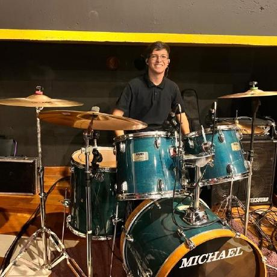
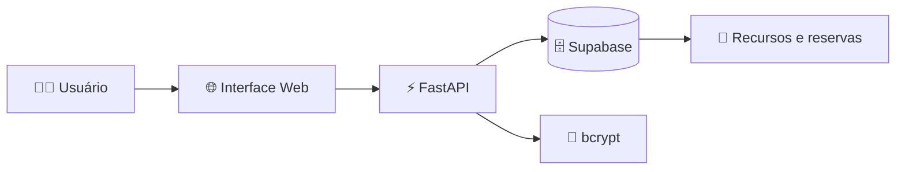

<div align="center">

  

  # 🚀 Reserva SENAI

  <p><strong>Gestão inteligente de reservas de salas, laboratórios e equipamentos.</strong></p>

  <p>
    ✨ Organize ocupação, consulte disponibilidade e simplifique o agendamento
    dos recursos do SENAI em um único lugar.
  </p>

  <p>
    
    
    
    
    
  </p>

  <p>
    
  </p>

</div>

---

## 💡 Sobre o projeto

O **Reserva SENAI** é uma plataforma web para organizar e controlar reservas
de salas, laboratórios, gabinetes e equipamentos.

A aplicação reduz o uso de planilhas, centraliza informações de disponibilidade
e oferece uma experiência mais rápida para professores e equipe administrativa.

## 👥 Nossa equipe

<table>
  <tr>
    <td align="center" width="50%">
      <h3>🧑‍💻 Matheus Catarucci</h3>
      
      <p><strong>Scrum Master • Back-end</strong></p>
      <p>Desenvolveu a API, o sistema de criptografia e auxiliar na coordenação geral do projeto.</p>
    </td>
    <td align="center" width="50%">
      <h3>⚙️ Guilherme Ballestrin</h3>
      
      <p><strong>Desenvolvedor Back-end</strong></p>
      <p>Auxiliou nas rotas gerais da API e na integração geral do projeto.</p>
    </td>
  </tr>
  <tr>
    <td align="center" width="50%">
      <h3>🎨 João Vitor</h3>
      
      <p><strong>Desenvolvedor Front-end • UI/UX</strong></p>
      <p>Desenvolveu as páginas HTML e realizou a estilização CSS da interface.</p>
    </td>
    <td align="center" width="50%">
      <h3>🎨 Gabriel</h3>
      
      <p><strong>Desenvolvedor Front-end • UI/UX</strong></p>
      <p>Desenvolveu as páginas HTML e realizou a estilização CSS da interface junto com as animações do JavaScript.</p>
    </td>
  </tr>
  <tr>
    <td align="center" colspan="2">
      <h3>🗄️ Moisés Tafarello</h3>
      
      <p><strong>Manipulador de Dados</strong></p>
      <p>Desenvolveu e arquitetou o banco de dados, responsável pelos testes e pela implantação dos serviços.</p>
    </td>
  </tr>
</table>

### 🎯 Funções da equipe

- **Matheus:** liderança do Scrum, desenvolvimento da API e criptografia.
- **Guilherme:** rotas da API, integração e suporte ao back-end.
- **João Vitor:** interface, experiência do usuário, HTML e CSS.
- **Gabriel:** interface, experiência do usuário, HTML, CSS e JS.
- **Moisés:** modelagem de dados, banco, testes e implantação.

## 🎓 Nossa história

Somos o **Grupo 6 do SENAI Jundiaí — Conde Alexandre Siciliano**, formado por
cinco estudantes que transformaram uma ideia em uma solução digital.

O Reserva SENAI nasceu da tentativa de organizar a rotina de reservas de salas,
laboratórios e equipamentos. Identificados por planilhas, mensagens e conversas,
o projeto queria oferecer um lugar centralizado, simples e seguro para consultar
recursos e acompanhar agendamentos.

Mais do que um sistema, este trabalho representa nossa evolução como
desenvolvedores: aprendemos a transformar necessidades reais em uma solução
web funcional, cuidada em cada detalhe.

## 🧠 O que aprendemos

- 💻 Desenvolver uma aplicação web com FastAPI e Python.
- 🗄️ Integrar uma aplicação com o Supabase.
- 🔐 Implementar autenticação e hash de senhas com bcrypt.
- 🎨 Construir uma interface responsiva com HTML, CSS e JavaScript.
- 🤝 Trabalhar em equipe, dividir responsabilidades e resolver problemas juntos.

## ✨ Funcionalidades

<table>
  <tr>
    <td width="50%">

### 🗓️ Reservas inteligentes

- Consulta de disponibilidade em tempo real.
- Reserva de salas, laboratórios e equipamentos.
- Acompanhamento de reservas e histórico de utilização.

    </td>
    <td width="50%">

### 🔐 Acesso seguro

- Autenticação protegida com **bcrypt**.
- Senhas nunca armazenadas em texto plano.
- Sessão de usuário para proteger páginas administrativas.

    </td>
  </tr>
  <tr>
    <td width="50%">

### 👨‍💼 Gestão centralizada

- Área administrativa para gestão dos recursos.
- Organização de usuários e permissões.
- Menos trabalho manual e mais eficiência.

    </td>
    <td width="50%">

### 📱 Experiência responsiva

- Interface adaptada para desktop e celular.
- 📋 Menus organizados
- Navegação simples e intuitiva.

    </td>
  </tr>
</table>

## 🛠️ Tecnologias utilizadas

| Tecnologia | Utilização |
|---|---|
| **FastAPI** | Framework da API e servidor web |
| **Python** | Backend da aplicação |
| **Supabase** | Persistência de usuários e dados |
| **HTML5** | Estrutura das páginas |
| **CSS3** | Layout, responsividade e identidade visual |
| **JavaScript** | Interações no frontend |
| **bcrypt** | Hash seguro das senhas |

## 🔄 Como funciona?


```mermaid
flowchart LR
    A[👨‍🏫 Usuário] --> B[🌐 Interface Web]
    B --> C[⚡ FastAPI]
    C --> D[(🗄️ Supabase)]
    C --> E[🔐 bcrypt]
    D --> F[📅 Recursos e reservas]
```

## 🚀 Começando

### Pré-requisitos

- Python 3.10 ou superior.
- Um projeto no Supabase configurado.
- Variáveis de ambiente do Supabase.

### 1. Clone o repositório

```bash
git clone https://github.com/seu-usuario/reserva-senai.git
cd reserva-senai
```

### 2. Crie um ambiente virtual

<details>
<summary><strong>Windows</strong></summary>

```powershell
python -m venv venv
.\\venv\\Scripts\\activate
```

</details>

<details>
<summary><strong>Linux ou macOS</strong></summary>

```bash
python3 -m venv venv
source venv/bin/activate
```

</details>

### 3. Instale as dependências

```bash
pip install -r requirements.txt
```

### 4. Prepare o banco

Rode, no SQL Editor do Supabase, os arquivos abaixo **nesta ordem**:

| Arquivo | O que faz |
|---|---|
| `reserva-Tcc.sql` | Esquema de referência. O próprio arquivo avisa que não deve ser executado; ele documenta as tabelas como estão. |
| `migracao_reservas.sql` | Acrescenta as colunas que o formulário de reserva preenche. |
| `migracao_schema.sql` | Ajustes que o código exige: status controlado, índices, `sala_id` opcional, trava de horário sobreposto, coluna `reservavel` e tabela de tentativas de login. |
| `migracao_rls.sql` | Liga a Row Level Security, que fecha o acesso anônimo direto ao banco. |

Todos os arquivos podem ser rodados mais de uma vez.

### 5. Configure as variáveis de ambiente

Copie o `.env.example` para `.env` e preencha:

```bash
copy .env.example .env
```

```env
SUPABASE_URL=https://seu-projeto.supabase.co

# Chave secreta do projeto (Project Settings -> API).
SUPABASE_KEY=sua-chave-secreta

# Chave usada para assinar o cookie de sessão.
# Gere com: python -c "import secrets; print(secrets.token_urlsafe(48))"
SECRET_KEY=uma-chave-aleatoria-longa
```

> **Importante:** o arquivo `.env` não deve ser enviado para o GitHub, e a
> `SECRET_KEY` precisa ser diferente da `SUPABASE_KEY`. Sem `SECRET_KEY` a
> aplicação não inicia.

### 6. Inicie a aplicação

```bash
uvicorn app:app --reload
```

Acesse a aplicação no navegador:

```text
http://127.0.0.1:8000
```

## 🔐 Segurança

- As senhas nunca são armazenadas em texto plano: o cadastro gera o hash
  com `hash_password()` e o banco recebe somente o hash bcrypt.
- O login chama `verify_password()`, que compara a senha com o hash.
- Nem a senha nem o hash aparecem em nenhuma resposta da API.
- O cookie de sessão é **criptografado** com `SECRET_KEY` (Fernet), uma chave
  separada da chave do banco: quem abrir o DevTools não lê o e-mail, o nome e
  o cargo de quem está logado, e não consegue forjar um cookie sem a chave.
- A sessão é renovada a cada login e expira em 8 horas.
- E-mail inexistente e senha errada recebem a mesma resposta, para não
  revelar quem tem conta no sistema.
- O login aceita 8 tentativas **por endereço** a cada 5 minutos. A contagem
  fica no banco (`login_tentativas`), e não na memória do processo, para
  valer igual em todas as instâncias; só tentativas que falham entram na
  conta, e um login certo zera a contagem.
- Quem é administrador sai do `cargo` gravado no banco (`Coordenador`),
  e não de um e-mail escrito no código.
- As rotas de dados exigem sessão; as de administração exigem o cargo de
  Coordenador, e o professor que abrir uma delas volta para a home dele.
- O RLS ligado no banco nega o acesso direto pelo PostgREST com a chave
  anônima, que é pública.

## 📡 Endpoints principais

| Método | Rota | Acesso | Descrição |
|---|---|---|---|
| `GET` | `/` | público | Página de login |
| `POST` | `/login` | público | Autenticação |
| `POST` | `/logout` | sessão | Encerra a sessão |
| `GET` | `/usuario_logado` | sessão | Dados do usuário da sessão |
| `GET` | `/usuarios` | coordenador | Listagem de usuários |
| `POST` | `/usuarios` | coordenador | Cadastro de usuário |
| `PUT` | `/usuarios/{id}` | coordenador | Edita usuário |
| `DELETE` | `/usuarios/{id}` | coordenador | Exclui usuário |
| `GET` | `/salas` | sessão | Salas reserváveis, com `contexto` e `categoria` |
| `GET` | `/salas/{id}` | sessão | Uma sala |
| `GET` | `/admin/salas` | coordenador | Todas as salas |
| `POST` | `/salas` | coordenador | Cadastra sala |
| `PUT` | `/salas/{id}` | coordenador | Edita sala |
| `DELETE` | `/salas/{id}` | coordenador | Exclui sala |
| `GET` | `/carrinhos` | sessão | Listagem de carrinhos |
| `GET` | `/reservas` | sessão | Reservas do professor (todas, se for coordenador) |
| `POST` | `/reservas` | sessão | Registra uma reserva como `aguardando` |
| `PATCH` | `/reservas/{id}/decisao` | dono ou coordenador | Aprovar/recusar (coordenador) ou cancelar (dono) |
| `GET` | `/home` | sessão | Início do professor |
| `GET` | `/home_admin` | coordenador | Início da administração |
| `GET` | `/aprovar_reservas_adm` | coordenador | Aprovação de reservas |
| `GET` | `/gerenciar_salas_adm` | coordenador | Gestão de salas |
| `GET` | `/professores_adm` | coordenador | Gestão de professores |
| `GET` | `/ajuda` | sessão | Central de ajuda |

Os status de uma reserva são `aguardando`, `aprovada`, `negada` e
`cancelada`. Uma reserva que colide com outra da mesma sala no mesmo
horário é recusada com `409`.

## 🧪 Testes

```bash
python tests/run.py
```

Ou um por vez:

```bash
python tests/test_api.py      # rotas, sessão, autorização, reservas
node tests/test_reservas.js   # módulo de reservas no navegador
node tests/test_avisos.js     # módulo de avisos no navegador
node tests/check_wiring.js    # rotas chamadas pelas telas que existem
```

Nenhum teste toca o banco de verdade: o cliente do Supabase é trocado por
um dublê que registra as consultas, e o do navegador por equivalentes em
JavaScript. Não é preciso instalar `pytest`.

## 🧩 Arquitetura JavaScript

A camada JavaScript foi separada em módulos para facilitar manutenção e testes:

```text
static/js/
├── api.js                 # Comunicação com a API
├── reservas.js            # Estado, sincronização e notificações das reservas
├── usuario.js             # Dados do usuário autenticado
├── menu.js                # Menu de perfil e menu mobile
├── faq.js                 # Acordeão de perguntas frequentes
├── search.js              # Utilitário de busca
├── avisos.js              # Estado dos avisos
├── notificacoes-push.js   # Notificações do navegador
└── pages/                 # Lógica específica de cada página
```

- `reservas.js` guarda as reservas no Supabase, pela rota `/reservas`, e
  mantém uma cópia no navegador para a tela abrir rápido e continuar
  funcionando sem internet. As leituras são síncronas, para os renders
  atuais não precisarem esperar a API.

- `usuario.js` exporta `carregarUsuario()`, chamada pelo módulo compartilhado.
- `pages/` contém apenas a lógica específica de cada tela.
- `salas.js` monta os cards das telas de escolha a partir de `GET /salas`.
- Os módulos compartilhados são carregados antes dos módulos de página.
- As telas do Coordenador ainda têm scripts inline, dentro do
  `<script type="module">` do fim do arquivo.

## Estrutura do projeto

```text
.
├── app.py                 # FastAPI: autorização, páginas e rotas
├── sessao.py              # Cookie de sessão criptografado (Fernet)
├── criptografia.py        # Hash e verificação de senhas com bcrypt
├── model.py               # Modelos e validações da aplicação
├── db.py                  # Conexão com o Supabase
├── consulta.py            # Consulta auxiliar de usuários
├── consulta_salas.py      # Filtro das salas que aparecem na reserva
├── migracao_reservas.sql  # Colunas usadas pelo formulário de reserva
├── migracao_schema.sql    # Ajustes de esquema exigidos pelo código
├── migracao_rls.sql       # Row Level Security
├── reserva-Tcc.sql        # Esquema de referência (não executar)
├── static/
│   ├── css/               # Estilos das páginas
│   ├── js/                # Interações do frontend
│   └── assets/            # Imagens e ícones
├── templates/             # Templates HTML
├── tests/                 # Testes (ver abaixo)
├── .env.example           # Modelo das variáveis de ambiente
├── .env                   # Variáveis de ambiente (não versionado)
└── requirements.txt       # Dependências do projeto
```

---

<div align="center">

Desenvolvido para organizar os recursos e simplificar a rotina do SENAI.

</div>
